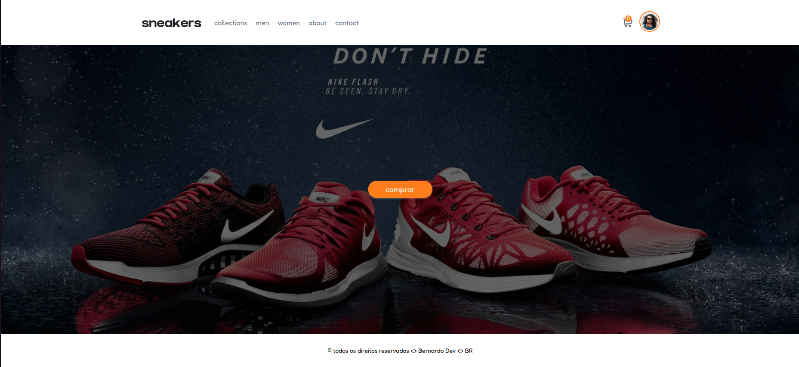

# Ecommerce Sneakers

Esse projeto tem como objetivo criar uma loja virtual de commércio eletrônico. O produto principal são tênis sneakers, onde é possível conhecer uma pequena quantidade de variedades e visualizar seus detalhes únicos. Ao encontrar o produto certo, é possível realizar uma compra através de um checkout.

**OBS: Essa projeto foi construido por mim, na minha conta conta antiga do Github que perdi o acesso dela, por isso, resolvi trazer o projeto para a conta que tenho acesso para realizar modificações.**

- Front-end | Projeto original: [BernardoOficial/Ecommerce Sneakers - Frontend](https://github.com/BernardoOficial/ecommerce-sneakers-frontend)
- Back-end | Projeto original: [BernardoOficial/Ecommerce Sneakers - Backend](https://github.com/BernardoOficial/ecommerce-sneakers-backend)

### Documentação

- **Front-end**: [documentação](./backend/README.md)
- **Back-end**: [documentação](./frontend/README.md)

### Visual das telas

**Tela inicial**

**Coleção**

